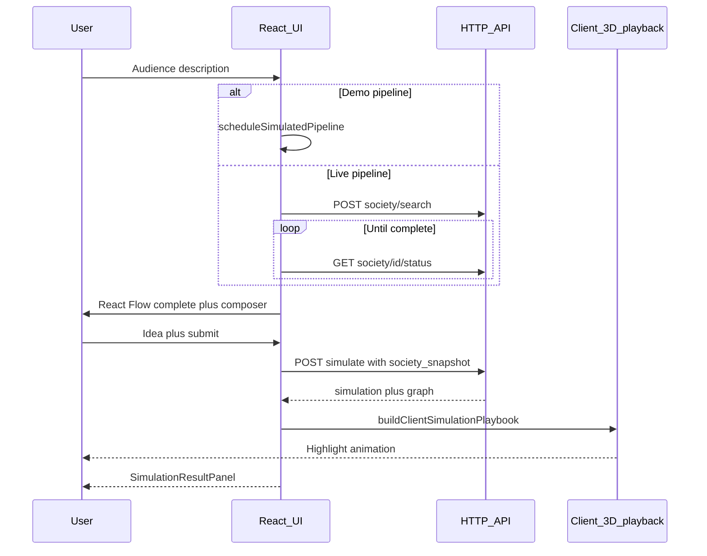

# Society builder → idea validation → 3D “simulation” → response

This document describes the **end-to-end product flow** as implemented in the Pollen client today, the **HTTP APIs** the UI expects, and how **responsibilities are split** between frontend and backend. It is meant for **backend alignment** and for **codebase cleanup** (for example, retiring unused WebSocket assumptions).

---

## 1. Executive summary

| Phase | What the user sees | Primary tech | Backend role |
|-------|--------------------|--------------|----------------|
| **A. Audience description** | Natural language search for a target audience | Search UI | Optional: create a `society_id` and kick off processing |
| **B. Society construction** | React Flow pipeline: query → index → profiles → personas → graph → output | `DynamicPipeline` + scripted or live updates | Optional: drive the same **event shapes** as the client demo (or return consolidated status) |
| **C. Idea input** | Floating composer on the completed graph | `FloatingIdeaComposer` | None until submit |
| **D. “Fake” 3D simulation** | `react-force-graph-3d` + particles, highlights, optional camera nudge | `SocietyGraph` + `buildClientSimulationPlaybook` | **None** — playback is **100% client-side** |
| **E. Final response** | Headline, narrative, metrics, quotes in the side panel | `SimulationResultPanel` | **`POST /api/simulate`** returns structured copy + metrics; no `playbook` |

**Key contract decision:** The server returns **`simulation`** (text + quotes + optional metrics) and **`graph`** (echo of nodes/links). The client **does not** use a server-authored `playbook` for the 3D view; it generates highlight frames locally from the graph and quote hints.

---

## 2. Detailed user journey

### Phase A — Initial description

1. User enters an **audience description** (natural language).
2. App calls **`onSearch(query)`** (wired from `SocietyBuilderView` → `App.handleSearch`).

**Two modes** (controlled by `VITE_PIPELINE_LIVE` in the client):

| Mode | Env | Behavior |
|------|-----|----------|
| **Demo (default)** | `VITE_PIPELINE_LIVE` unset or not `"true"` | No society HTTP call. Client returns a synthetic `society_id` (e.g. `sim_<timestamp>`) after a short delay. |
| **Live** | `VITE_PIPELINE_LIVE=true` | Client calls **`POST /api/society/search`** with `{ query }` and expects `{ society_id, status, message }`. |

### Phase B — Visual construction of the audience (React Flow)

3. With a `society_id`, `SocietyBuilderView` enables **`usePipelineUpdates(societyId, true, { query })`**.

**Demo mode**

- `scheduleSimulatedPipeline` emits a **scripted sequence** of updates with the same **semantic event types** the live path would consume:
  - `profile_found`, `profile_scraped`
  - `persona_synthesizing`, `persona_complete`
  - `graph_progress`, **`graph_complete`**

**Live mode (client expectations today)**

- Client first tries **`WebSocket`** `VITE_WS_URL` + path **`/api/society/stream/:society_id`** (see `usePipelineUpdates.js`).
- On failure or unsupported environment, it falls back to **`GET /api/society/:societyId/status`** every ~2s until `status === 'complete'`.

**Important for backend alignment**

- The **Express server in this repo today** only mounts **`POST /api/society/generate`** under `/api/society` — there is **no** implemented `search`, `status`, or WebSocket route in `server/index.js` / `server/routes/society.js` as of this writing. Live mode is a **forward-looking contract** in the client.
- **Recommendation:** Standardize on **HTTP polling** or **SSE** for builder progress and **drop WebSocket** from the product requirements unless you have a hard requirement for bidirectional streaming. That matches the user’s direction to remove WebSocket support.

4. **`graph_complete`** must include at least:

```json
{
  "status": "complete",
  "clusters": ["..."],
  "nodes": [ { "id", "name", "archetype", "val", "color", ... } ],
  "links": [ { "source": "<id>", "target": "<id>", ... } ]
}
```

This object is what the UI treats as the **authoritative society graph** for the next phase.

### Phase C — Idea input (validate against the society)

5. When the pipeline reports **complete** and `graphState.nodes` is non-empty, **`FloatingIdeaComposer`** appears (non-blocking over React Flow).
6. User types an **idea / pitch / message** and submits.
7. Client calls **`onSimulationRequest`** with:

```json
{
  "societyId": "<society_id>",
  "ideaPrompt": "<trimmed text>",
  "societySnapshot": {
    "nodes": "<graphState.nodes>",
    "links": "<graphState.links>"
  }
}
```

**Note:** `seed_strategy` is still sent for compatibility but the **current** simulation engine ignores it.

### Phase D — “Fake” 3D graph simulation

8. App switches view to **`SimulationView`** (builder stays mounted but hidden so state is preserved when returning).
9. **`buildClientSimulationPlaybook(graph, { quotes })`** builds up to **24 frames** of `{ activeNodeIds, activeLinkKeys, caption }` using graph topology (BFS from seeds derived from quote `persona_id`s or high-degree nodes). **`useSimulationPlayback`** advances frames on a timer.
10. **`SocietyGraph`** uses `react-force-graph-3d` + THREE: active nodes/links get stronger emissive color, thicker links, and more directional particles. Optional camera nudge toward the active node when positions exist.

**Backend does not participate** in this animation.

### Phase E — Final response output

11. **`POST /api/simulate`** returns (success path):

```json
{
  "society_id": "<id>",
  "simulation": {
    "headline": "string",
    "narrative": "string",
    "quotes": [
      {
        "persona_id": "<optional graph node id>",
        "name": "string",
        "archetype": "string",
        "quote": "string",
        "sentiment": "positive | negative | neutral"
      }
    ],
    "metrics": {
      "adoption_rate": 0.0,
      "positive_count": 0,
      "negative_count": 0,
      "neutral_count": 0
    }
  },
  "graph": {
    "nodes": [],
    "links": []
  }
}
```

12. **`SimulationResultPanel`** shows headline, narrative, adoption badges, and quote cards.

**Client resilience**

- If **`POST /api/simulate`** fails (network, 5xx), `App` uses **`buildLocalSimulation`** so the demo still navigates to the simulation view with deterministic placeholder copy.

---

## 3. Endpoint catalog (for backend team)

Base URL: client uses `VITE_API_URL` or defaults to **`/api`** (proxied to the Node server, typically port **3001**).

### 3.1 Used by the main Society Builder + simulation UX

| Method | Path | Purpose | Caller | Status in repo |
|--------|------|---------|--------|-----------------|
| `POST` | `/api/simulate` | Idea → society summary + quotes + metrics; returns `graph` echo | `api.runSimulation` | **Implemented** |
| `GET` | `/api/health` | Liveness / config flags | `api.healthCheck` | **Implemented** |

### 3.2 Expected when “live pipeline” is enabled (`VITE_PIPELINE_LIVE=true`)

| Method | Path | Purpose | Caller | Status in repo |
|--------|------|---------|--------|-----------------|
| `POST` | `/api/society/search` | Start society build from natural language query | `api.searchLinkedIn` | **Client expects; server route not present** in current `society.js` |
| `GET` | `/api/society/:societyId/status` | Poll aggregated society + `graphState` | `usePipelineUpdates` (fetch) | **Client expects; server route not present** |

### 3.3 Legacy / secondary (not on the critical path for the builder→sim flow)

| Method | Path | Purpose | Notes |
|--------|------|---------|--------|
| `POST` | `/api/society/generate` | Legacy bulk society generation | Implemented; **`api.generateSociety`** — different shape than index builder |
| `POST` | `/api/persona/respond` | Single-persona reaction | **`api.testPersona`** — optional tooling, not used by main sim view |

### 3.4 WebSocket (deprecated / remove)

| Protocol | URL pattern | Purpose | Recommendation |
|----------|-------------|---------|----------------|
| WS | `${VITE_WS_URL}/api/society/stream/:societyId` | Stream pipeline events | **Remove** from client once backend exposes **polling or SSE** with the same event payloads (or a single `GET status` that returns full state). |

---

## 4. Event shapes for live pipeline (if you keep parity with the demo)

If the backend drives the same UX as `scheduleSimulatedPipeline`, each message (WS frame, SSE chunk, or embedded array in `GET status`) should be JSON objects with **`type`** and type-specific fields. Minimal set:

| `type` | Role |
|--------|------|
| `profile_found` | `{ profile }` |
| `profile_scraped` | `{ profile }` |
| `persona_synthesizing` | `{ profileId, persona }` |
| `persona_complete` | `{ persona }` |
| `graph_progress` | `{ message, connectionsBuilt, totalConnections }` |
| `graph_complete` | `{ clusters, nodes, links, ... }` |

The **`graph_complete`** payload is what becomes **`society_snapshot`** at simulate time.

---

## 5. Responsibility split (cheat sheet)

| Concern | Owner |
|---------|--------|
| React Flow layout and pipeline copy | Frontend |
| Scripted demo pipeline | Frontend (`pipelineSimulation.js`) |
| LLM society summary + quotes for an idea | Backend (`POST /api/simulate`) |
| 3D graph layout (force), highlight animation, camera nudge | Frontend |
| Storing `society_id` server-side vs client-only `sim_*` | Product/backend choice; **snapshot** path supports client-only IDs |

---

## 6. Suggested cleanup checklist (frontend + docs)

1. **Remove WebSocket path** from `usePipelineUpdates.js` (and `VITE_WS_URL` from `.env.example` / docs) once `GET /api/society/:id/status` (or SSE) is the single live strategy.
2. **Update** `client/src/lib/pipelineConfig.js` and `client/src/api/client.js` comments to say **polling** instead of “WebSocket preferred”.
3. **Implement or formally defer** `POST /api/society/search` + `GET /api/society/:id/status` on the server, or **turn off** `VITE_PIPELINE_LIVE` in all demo envs until ready.
4. **Archive** `SOCIETY_BUILDER_V2.md` WebSocket-heavy sections or mark them superseded by this doc + polling contract.
5. **README**: align the “simulate” response example with `{ simulation, graph }` (no `playbook`).

---

## 7. Sequence diagram (conceptual)



---

## 8. One-line pitch for the backend team

> **Implement `POST /api/society/search` + `GET /api/society/:id/status` (or SSE) using the same event types as the client demo; keep `POST /api/simulate` as the only server call for idea validation, returning `simulation` + `graph` with no playback field; let the client own all 3D animation.**

If you want this file under a different name or location, say where and we can move it.
